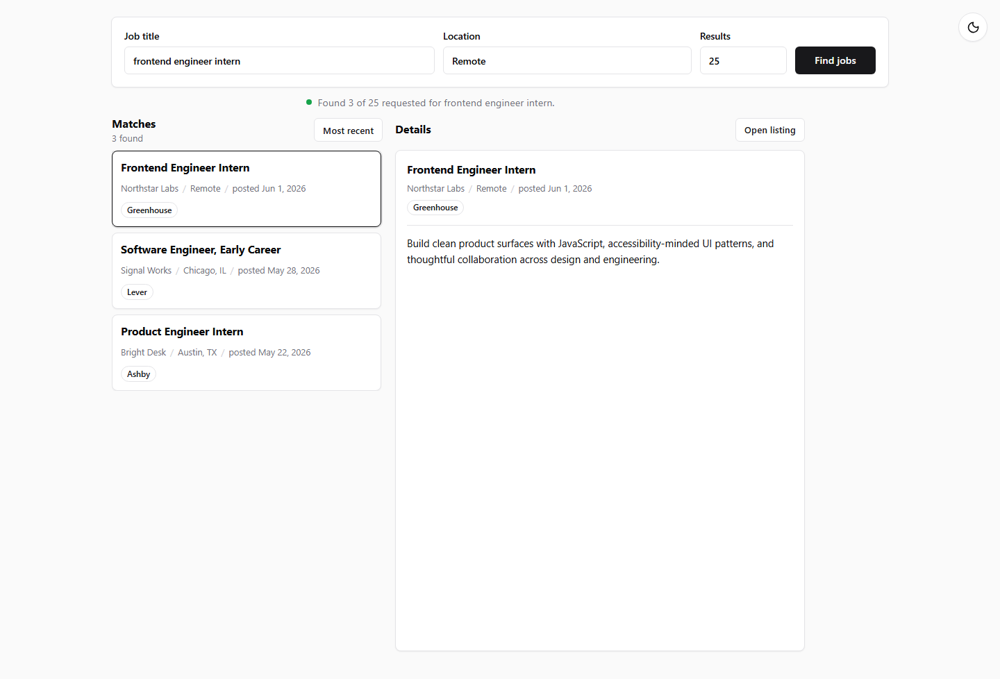

# Resume Job Agent

Resume Job Agent is a local job discovery tool for finding public job listings by title, location, and result count. It searches publicly available pages and posting endpoints, ranks matching roles, and presents them in a clean local UI.



## Features

- Search jobs by title, location, and desired result count.
- Discover listings from public job boards, ATS endpoints, and public web results.
- Rank matches by title relevance, location fit, freshness, and listing quality signals.
- Review matching jobs in a split results/detail interface.
- Toggle between light and dark mode with a persistent preference.
- Store discovered listings locally in `data/job-index.json`.

## Quick Start

```bash
npm install
npm start
```

Open [http://localhost:3000](http://localhost:3000).

For development with auto-restart:

```bash
npm run dev
```

## How It Works

Enter a target role, location, and result count, then select **Find jobs**. The app discovers candidate listings, filters them against the search intent, ranks the best matches, saves them locally, and displays the results in the browser.

| Discovery method | Description |
| --- | --- |
| Direct search | Opens supported job board search pages and parses visible job cards. |
| ATS discovery | Uses public Greenhouse, Ashby, and Lever board/posting endpoints when available. |
| Public web discovery | Searches public web results scoped to job-site domains, then fetches matching posting pages. |

## Supported Sources

Direct search currently targets LinkedIn and Indeed. ATS discovery supports Greenhouse, Ashby, and Lever. Public web discovery includes major job boards, remote-work boards, startup and tech boards, design boards, sales and marketing boards, finance boards, government and nonprofit boards, and selected public hiring posts.

The app does not bypass login walls, CAPTCHAs, paywalls, or access controls. Sources such as Glassdoor, Handshake, Simplify.jobs, Facebook, and X/Twitter are intentionally excluded when they require restricted access.

## Project Structure

| Path | Purpose |
| --- | --- |
| `src/server.js` | Express server and API routes. |
| `src/jobIndex/` | Job discovery, indexing, source adapters, and matching logic. |
| `public/` | Browser UI assets. |
| `data/job-index.json` | Local job index generated by discovery runs. |
| `docs/` | Documentation and UI assets. |

## Testing

Run syntax and regression checks:

```bash
npm run check
npm test
```

## Notes

This project is designed for local use and public-data discovery. Search reliability depends on the availability and structure of public listing pages, which can change over time.
